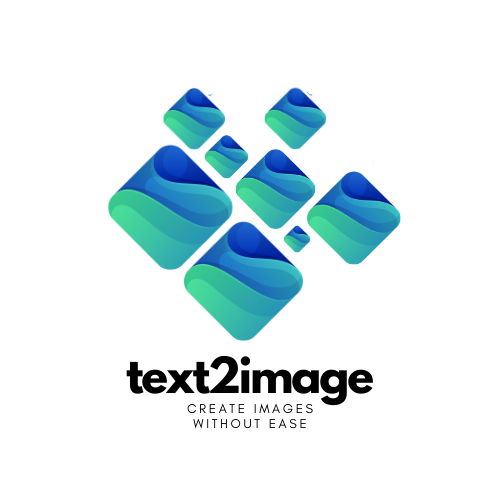
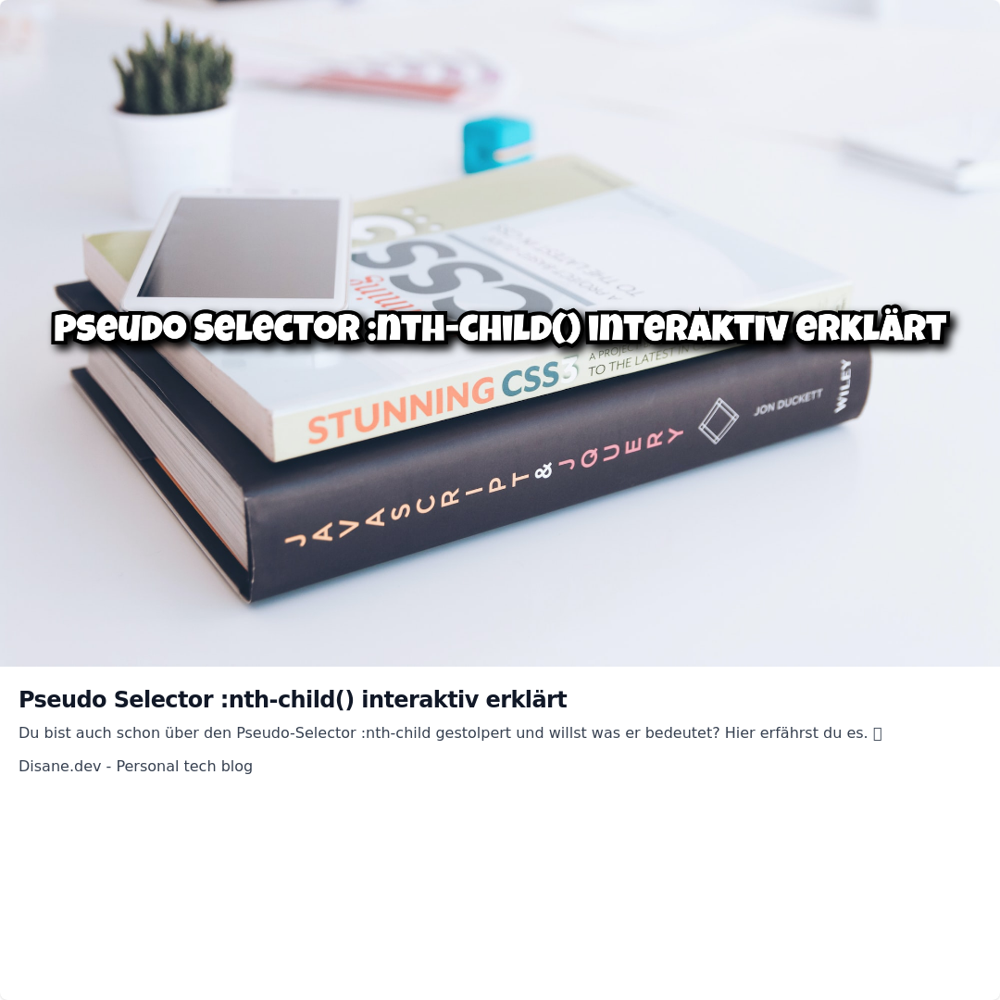

<!-- [](https://github.com/hacs/integration)
[](https://github.com/Disane87/spoolman-homeassistant/actions/workflows/validate.yml)


[](https://github.com/semantic-release/semantic-release) -->



# text2image

This docker container enables you to create images from links. This is pretty useful for using in blogs or automations (like [n8n](https://blog.disane.dev/n8n-unleashed/)).

# ✨ Features

- Customizable presets (for sizes or templates)
- Highly customziable via HTML/CSS
- Complete support füpr custom fonts
- Built-in [TailwindCSS](https://tailwindcss.com/docs/installation) support
- Runs within a Docker container
- Secured by configurable `API_KEY`
- Generate images from URLs with [OpenGraph](https://ogp.me/) fetching

> [!NOTE]
> Using the `API_KEY` is mandatory to prevent unauthorized access

# 🏗️ Installation

To use this piece of software you need a Docker host. Just run the following command and youÄre good to go:

```bash
docker run -d --name='text2image' -e 'API_KEY'='[YOUR API-KEY]' -p '3000:3000/tcp'  'disane/text2image'

```

# 🛠️ Usage

You can create new images by browsing the following url (only `GET` is supported):

```bash
curl -XGET 'https://[YOUR URL]:3000/image/[:preset]/[image]/?url=https://images.unsplash.com/photo-1682686581660-3693f0c588d2&text=Test'
```

# 🤔 Parameters

| Param     | Mandatory | Default | Description                                                    |
| --------- | --------- | ------- | -------------------------------------------------------------- |
| preset    | yes       | null    | Preset to use. Defined in \`./config/presets.json\`            |
| url       | yes       | null    | Used to fetch an image or OpenGraph data                       |
| openGraph | no        | false   | Activates fetching opengraph data                              |
| text      | depends   | null    | Test to show in image (only needed when `openGraph` = `false`) |
| image     | yes       | null    | Filename with extension                                        |

# 👨‍💻 Presets

You can add `presets` for different purposes like social media images or something else. All presets are defined in `./config/presets.json`:

```json
{
  "blog": {
    "sizes": {
      "width": 1920,
      "height": 1080
    },
    "template": "blog.hbs"
  },
  "instagram": {
    "sizes": {
      "width": 1080,
      "height": 1080
    },
    "template": "instagram.hbs"
  }
}
```

> [!NOTE]
> Every preset has only one template. This templates uses simple HTML/CSS with native TailwindCSS support.

# 💫 Customizing

With [handlebars](https://handlebarsjs.com/) it's possible to use pre-defined data within preset templates.

These variables/placholders are available:

- In `OpenGraph` mode: All `<meta property="og:[xyz]"></meta>` are converted to an object.
  Conversion convention: `og:` is removed and all `:` are replaced by `_`. In example `og:title` would be `title`. `og:image:width` would be `image_width`.

- In `normal` mode (`OpenGraph` = `false`) only `imageUrl`, `preset` and `text` is available.

# 🚀 Examples

## OpenGraph



```bash
GET https://[YOUR URL]/image/instagram/test.jpg/?openGraph=true&url=https://blog.disane.dev/pseudo-selector-nth-child-ganz-einfach-erklart/
```

## Normal Mode


```bash
GET https://[YOUR URL]/image/blog/test.jpg?url=https://images.unsplash.com/photo-1682687982468-4584ff11f88a&text=Wonderful%20image
```

# Cheers 🔥
